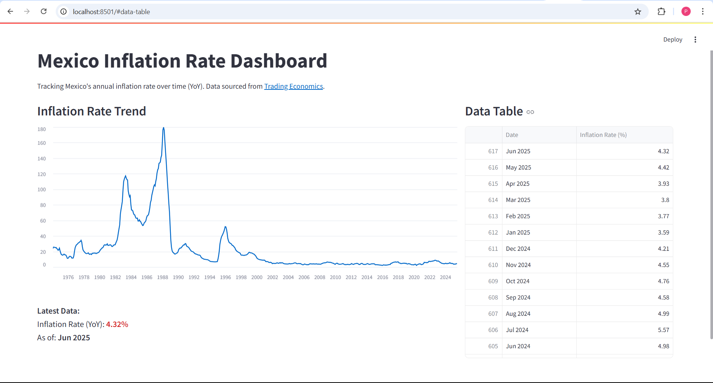

# Mexico Inflation Rate Dashboard

This Streamlit web app displays Mexico's annual inflation rate (YoY) over time using data from the Trading Economics API.

## 🔧 Features
- Line chart of inflation rate trend
- Data table of monthly inflation values
- Filters out incomplete months to ensure accuracy

## Tech Stack
- Python
- Streamlit
- Trading Economics API
- Pandas

## API Endpoint Used
`https://api.tradingeconomics.com/historical/country/mexico/indicator/inflation%20rate`

## How to Run
1. Clone the repo
2. Install requirements: `pip install -r requirements.txt`
3. Run the app: `streamlit run inflation.py`

## Notes
Only publicly available data (e.g., Mexico) was used based on the limits of the free developer account.

